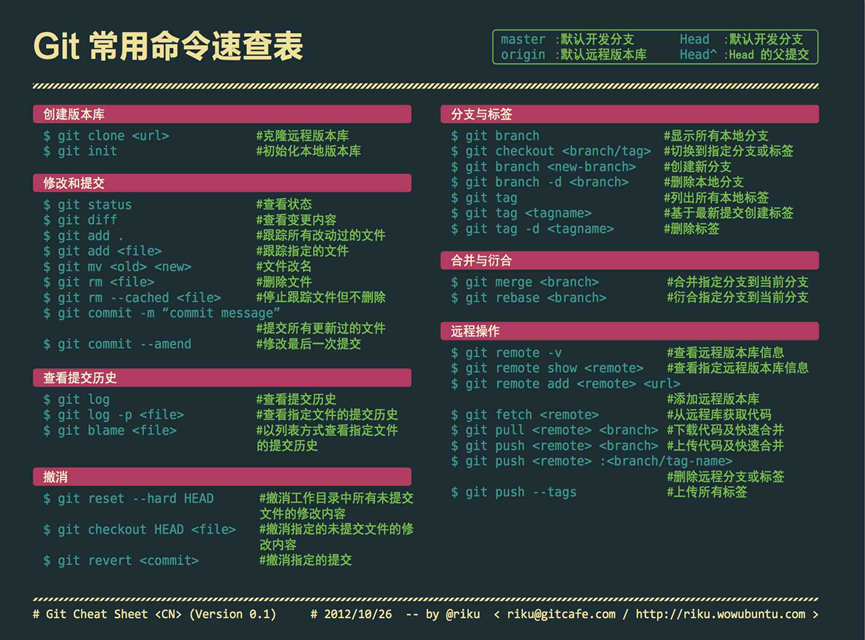

# -

右键powershell管理员打开
dir .查看当前目录
-m 文件名 删除当前文件夹
cd 文件名 进入某个文件夹
cd ..进入上一文件夹
pwd 查看当前路径
Remove-Item -LiteralPath "路径" -Recurse -Force 彻底删除该文件夹
Test-Path "路径" 删除后测试，返回false表示删除成功

创建初始化项目：
cd ~\Documents
mkdir test
cd test
git init
"Git练习项目" > README.md
git add .
git commit -m "初始化项目"

练习1 观察工作区状态
New-Item note.txt 创建空文件
"第一篇笔记" > note.txt等价于 "第一篇笔记" | Set-Content note.txt
> 会覆盖原文件内容，想保留旧内容并继续写，用 >>；eg: "第二行内容" >> note.txt
查看状态git status，这时候应该出现在Untracked files中
代码：
"第一篇笔记" > note.txt
git status

练习2 观察差异
git diff              工作区 vs 缓存区
git diff --staged     缓存区 vs 最近提交
git diff HEAD         当前全部修改 vs 最近提交
code：
"第二行" >> note.txt
git diff
git add note.txt
git diff
git diff --staged
git diff HEAD

练习3 创建多个小提交
Code:
git commit -m "添加学习笔记"
"用户功能" | Set-Content user.txt
git add user.txt
git commit -m "添加用户示例"
"订单功能" | Set-Content order.txt
git add order.txt
git commit -m "添加订单示例"
git log --oneline

整套操作可以理解为：
note.txt  → 提交 1：添加学习笔记
user.txt  → 提交 2：添加用户示例
order.txt → 提交 3：添加订单示例
你看：是先做了事情，再做个笔记

git log –oneline: 会保存在当前项目隐藏的 .git 数据库中，不会写入 note.txt
会显示类似：
c81a3f2 添加订单示例
9db75a1 添加用户示例
4a0ce82 添加学习笔记
左边是提交 ID，右边是 -m 写的提交说明。最新提交排在最上面。
查看最新一次提交：git log -1 –oneline
查看最新提交的详细信息：git show HEAD
查看所有详细提交记录：git log

就会出现这么一种东西啊

